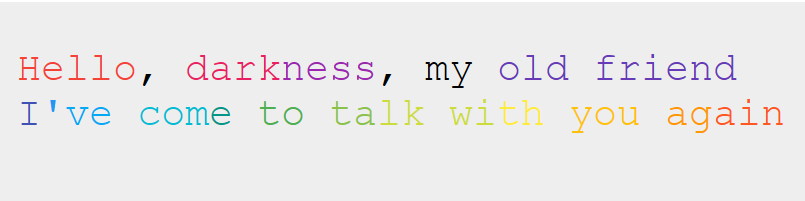

# Word Highlighter

This is **NOT** a [highlight.js](https://highlightjs.org/) plugin.

```html
<pre style="background-color: #eee;">
  <code class="word-highlighter">
    #1{Hello}, #2{dark}#3{ness}, my #4{old friend}
    #5{I}#6{'}#7{ve} #8{com}#9{e} #10{to} #11{ta}#12{lk wi}#13{th} #14{you} #15{ag}#16{ain}
  </code>
</pre>
```



## Usage

Add this to your HTML

```html
<script src="/path/to/word-highlighter.min.js"></script>
```

Or require as common modules

```javascript
const wordHighligher = require('word-highlighter');
wordHighligher.registerColors([
  '#ff0000',
  '#00ff00',
  '#0000ff',
])
const html = wordHighligher.renderHtml('#1{Hello} #5{World}'); // ((5 - 1) % 3) + 1) = 2 (Out of bounds safe)
// outputs <span class="word-highlighter-1">Hello</span> <span class="word-highlighter-2">World</span>
const css = wordHighligher.generateCss();
// outputs .word-highlighter-1 {color: '#ff0000'} .word-highlighter-2 {color: '#00ff00'} .word-highlighter-3 {color: '#0000ff'}
```
